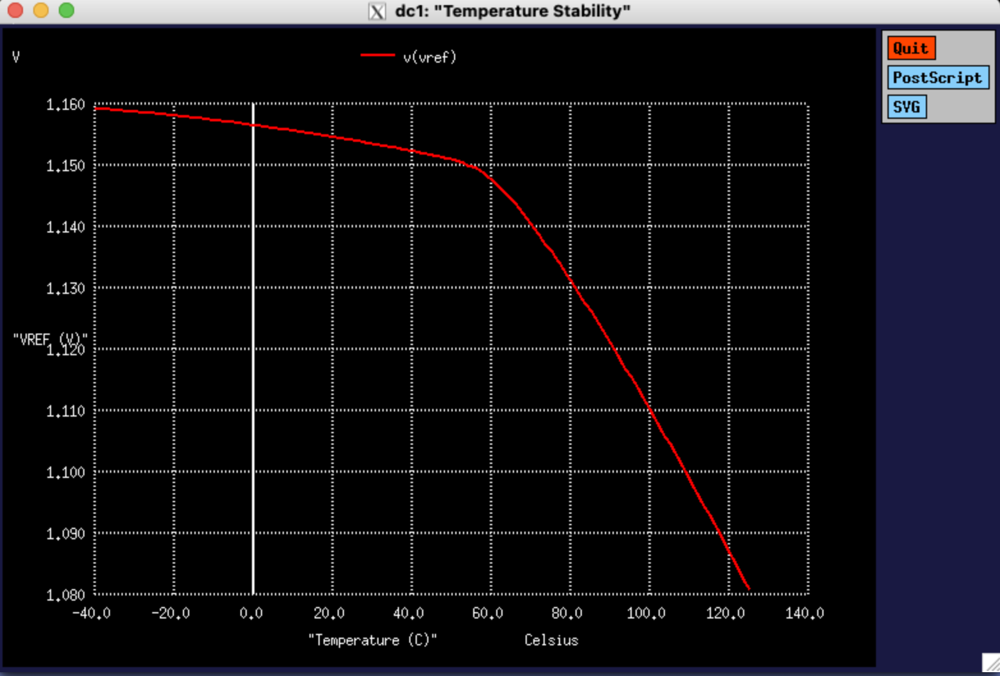
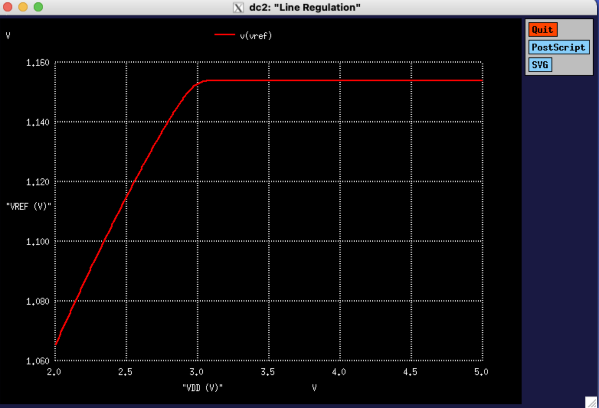
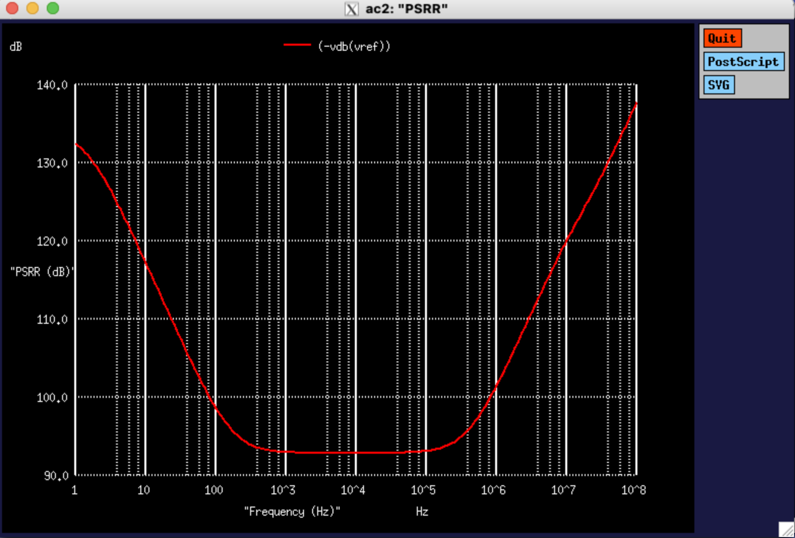

# Bandgap Reference Circuit — NGSPICE Simulation Suite

**CMOS bandgap voltage reference designs simulated in NGSPICE. v1 includes Python-based post-processing; v2 plots are captured directly from NGSPICE via XQuartz.**

Two circuit implementations are provided: a classic current-mirror-based BGR (v1) and a behavioural op-amp-assisted Widlar BGR (v2). Both are verified across temperature, supply voltage, and frequency using industry-standard figures of merit.

---

## Repository Structure

```
bandgap_reference_ngspice/
├── ngspice/
│   ├── bandgap_classic.cir       # v1 — Classic BGR
│   └── widlar_bgr.cir            # v2 — Widlar BGR (op-amp assisted)
├── python/
│   └── plot_bgr_results.py       # v1 post-processing and plot generation
├── results/
│   ├── widlar_temp.png           # v2 — VREF vs. temperature (XQuartz capture)
│   ├── widlar_psrr.png           # v2 — PSRR vs. frequency (XQuartz capture)
│   └── widlar_lr.png             # v2 — VREF vs. VDD (XQuartz capture)
└── README.md
```

---

## v1 — Classic Bandgap Reference

### Architecture

A conventional Brokaw-style BGR using a 1:8 BJT area ratio pair, PMOS current mirror for branch equalisation, and a resistor divider to scale the output to ~1.25 V. The op-amp is modelled as an ideal VCVS (gain = 10⁶).

**Topology summary:**
- BJT pair (Q1 × 1, Q2 × 8) generates ΔVBE proportional to absolute temperature (PTAT)
- PMOS mirror (W = 20 µm, L = 1 µm) enforces equal branch currents
- Output resistor network (R3 = 11 kΩ, R4 = 4 kΩ) scales VREF to ~1.25 V
- Minimal BJT model: IS = 10⁻¹⁶ A, BF = 100

### Simulation Coverage

| Analysis | Sweep |
|---|---|
| Temperature stability | −40 °C to 125 °C, 2 °C step |
| Line regulation | VDD = 2.7 V to 3.6 V, 100 mV step |
| Startup transient | 0 – 100 µs |
| PSRR | 1 Hz – 10 MHz, AC |

### Key Results

| Parameter | Value |
|---|---|
| Reference Voltage (27 °C) | ~1.25 V |
| Temperature Coefficient | 38.69 ppm/°C |
| Line Regulation | 6.5 mV/V |
| Startup Settling Time | 230.52 µs |
| PSRR (DC / 1 MHz) | 80 dB |

> **Note on simulation fidelity:** The v1 figures should be interpreted as idealised bounds rather than physically realistic predictions. Three modelling choices produce artificially optimistic results:
>
> 1. **Ideal op-amp (EOPAMP, gain = 10⁶):** A VCVS with no poles, no bandwidth limit, and no output impedance enforces perfect branch equalisation at all frequencies. In a real implementation, finite GBW and phase margin degrade both TC and PSRR significantly.
>
> 2. **Minimal BJT model (`IS`, `BF` only):** The absence of Early voltage (VAF), parasitic resistances (RB, RC, RE), junction capacitances (CJE, CJC), and temperature scaling parameters (XTB, EG, XTI) means transistor characteristics do not degrade with temperature or operating point. The reported TC therefore reflects ideal PTAT/CTAT cancellation with no second-order distortion.
>
> 3. **TC formula with hardcoded denominator:** The measurement expression `(VBG_MAX - VBG_MIN) / (125 - (-40)) / 1.25 × 10⁶` divides by a fixed nominal of 1.25 V regardless of the simulated VREF. Any output offset from 1.25 V compresses the reported ppm/°C figure.
>
> 4. **No AC stimulus for PSRR:** The `.AC` analysis contains no series injection source on the supply rail. Without a defined small-signal input at VDD, the measured `VDB(VBGR)` reflects the absolute output magnitude rather than a supply-to-output transfer function, preventing the result from being interpreted as a true supply-to-output PSRR transfer function.
>
> These limitations are addressed directly in v2.

---

## v2 — Op-Amp Assisted Widlar Bandgap Reference

### Design Motivation

The classic implementation relies on an ideal voltage-controlled source and a first-order BJT model, which limits physical accuracy and obscures real circuit behaviour. v2 replaces these abstractions with a behaviourally grounded implementation: a subcircuit op-amp with finite gain, a dominant pole, and output clamping; a full Gummel-Poon NPN model with parasitic resistances, junction capacitances, and temperature scaling parameters; and an explicit PTAT extraction mechanism via the Widlar emitter-degeneration technique.

The design is intentionally implemented without a physical current mirror. PTAT and CTAT signals are extracted independently and summed via controlled sources, making each compensation term directly observable in simulation — a structure well suited to design exploration and sensitivity analysis.

### Architecture

```
VDD ──┬── RFILT (120 Ω) ──── VDDL (local filtered rail)
      │                        │           │           │
    CFILT                    RC1         RC2         IREF (5 µA)
    (8 µF)                   │           │           │
                            NC1         NC2         NCTAT
                             │           │           │
                            Q1(×1)    Q2(×8)       Q3 (diode)
                             │           │           │
                            GND        NE2          GND
                                        │
                                    RPTAT (4.3 kΩ)
                                        │
                                       GND

  Op-amp: NC1(+) → NC2(−) → NBASE (feedback)
  EPTAT:  NPTAT = V(NE2) × 9.5
  ESUM:   VREF  = V(NCTAT) + V(NPTAT)
```

**PTAT extraction (Widlar core):** The op-amp servo drives NBASE such that collector voltages NC1 ≈ NC2. The 8× emitter area ratio between Q2 and Q1 establishes a ΔVBE = (kT/q) · ln(8) between the two transistors; the emitter degeneration resistor (RPTAT = 4.3 kΩ) converts this ΔVBE into an approximately PTAT voltage at node NE2. This voltage is scaled by a factor of 9.5 via a controlled source (EPTAT) to generate the PTAT compensation component.

**CTAT extraction:** A precision current source (IREF = 5 µA) biases a diode-connected NPN (Q3 × 1). The forward voltage V(NCTAT) ≈ VBE exhibits a negative temperature coefficient (~−2 mV/°C), providing the CTAT component.

**Summation:** VREF = V(NCTAT) + V(NPTAT) is formed explicitly by ESUM, with a 1 MΩ load and 80 pF output capacitance for stability.

**Supply filtering:** A 120 Ω / 8 µF RC filter on VDDL decouples the bandgap core from supply noise, improving low-frequency PSRR. PSRR is measured via a series AC injection source (VAC) on the supply path.

### BJT Model

A full Gummel-Poon model is used for all three transistors:

| Parameter | Value | Description |
|---|---|---|
| IS | 8 × 10⁻¹⁷ A | Saturation current |
| BF | 180 | Forward current gain |
| VAF | 120 V | Early voltage |
| RB / RC / RE | 60 / 20 / 0.5 Ω | Parasitic resistances |
| CJE / CJC | 0.45 pF / 0.15 pF | Junction capacitances |
| TF / TR | 0.25 ns / 8 ns | Transit times |
| XTB | 1.5 | BF temperature exponent |
| EG | 1.11 eV | Silicon bandgap energy |
| XTI | 3 | IS temperature exponent |

XTB, EG, and XTI together govern the temperature dependence of gain and leakage current — parameters absent from the v1 model — and are critical for accurate TC simulation over a wide temperature range.

### Op-Amp Subcircuit

The behavioural op-amp is modelled as a single-pole amplifier with output clamping:

| Parameter | Value |
|---|---|
| DC gain | 2 × 10⁵ V/V (~106 dB) |
| Dominant pole (RP1 · CP1) | ~2 MHz |
| Output resistance | 50 Ω |
| Output clamp | Schottky-like diodes to VCC / VEE |

### Simulation Coverage

| Analysis | Sweep |
|---|---|
| Operating point | VDD = 3.3 V, T = 27 °C |
| Temperature stability | −40 °C to 125 °C, 1 °C step |
| Line regulation | VDD = 2.0 V to 5.0 V, 10 mV step |
| PSRR | 1 Hz to 100 MHz, 30 pts/decade |

### Simulation Results

#### Operating Point

| Parameter | Value |
|---|---|
| Supply current I(VDD) | 29.88 µA |
| VREF (27 °C) | 1.1539 V |

#### Temperature Stability (−40 °C to 125 °C)

| Parameter | Value |
|---|---|
| VREF at 27 °C | 1.1539 V |
| VREF at −40 °C (max) | 1.1593 V |
| VREF at 125 °C (min) | 1.0809 V |
| Total variation ΔV | 78.4 mV |
| Temperature coefficient | ~458 ppm/°C |

> The reference exhibits a dominant CTAT characteristic over the full −40 °C to 125 °C range, with partial PTAT compensation effective below ~60 °C. The PTAT scaling factor (9.5×) is calibrated for a narrower compensation window; the monotonic roll-off above 60 °C indicates the PTAT term under-compensates the CTAT slope at elevated temperatures. This is a known design trade-off when using explicit controlled-source summation without closed-loop TC trimming.



#### Line Regulation (VDD = 2.0 V to 5.0 V)

| Parameter | Value |
|---|---|
| VREF at VDD = 2.0 V | 1.0654 V |
| VREF at VDD = 4.99 V | 1.1539 V |
| Regulated range onset | VDD ≈ 3.1 V |
| VREF in regulated region | 1.154 V (flat) |
| Line regulation (3.1 V – 5.0 V) | < 1 mV/V |

> The reference enters regulation at VDD ≈ 3.1 V. Above this threshold, VREF is flat to within the resolution of the sweep, demonstrating strong supply rejection in the normal operating range. The roll-off below 3.1 V reflects dropout of the RC-filtered local rail (VDDL), not an instability in the core bandgap loop.



#### Power Supply Rejection Ratio (1 Hz to 100 MHz)

| Frequency | PSRR |
|---|---|
| 1 Hz | 132.4 dB |
| 1 kHz | 92.98 dB |
| 100 kHz | 93.13 dB |
| Mid-band minimum | ~93 dB (1 kHz – 100 kHz) |

> The 132 dB low-frequency PSRR reflects the combined attenuation of the RC supply filter and the high open-loop gain of the op-amp servo. The mid-band floor (~93 dB) is set by the op-amp gain-bandwidth product and the pole introduced by the output filter (ROUTL ∥ COUT). The high-frequency rise visible above 10 MHz is likely consistent with capacitive feedthrough through transistor junction capacitances and reduced loop gain at high frequency — a physically plausible artefact of the full Gummel-Poon model.



---

## v1 vs. v2 — Comparative Summary

| Feature | v1 Classic BGR | v2 Widlar BGR |
|---|---|---|
| Op-amp model | Ideal VCVS, gain = 10⁶ | Subcircuit: dominant pole, output clamp, Rout = 50 Ω |
| PTAT mechanism | Mirror current imbalance (implicit) | Explicit ΔVBE across emitter resistor (Widlar) |
| CTAT source | Embedded in BJT pair | Dedicated current-biased diode branch |
| PTAT/CTAT summation | Resistor network | Controlled-source explicit sum (E-sources) |
| BJT model | IS, BF only | Full Gummel-Poon: VAF, parasitic R/C, XTB, EG, XTI |
| Supply filtering | None | RC (120 Ω / 8 µF) on local rail |
| PSRR injection method | VDD node direct | Series VAC source for accurate transfer function |
| Temperature sweep step | 2 °C | 1 °C |
| PSRR sweep range | 1 Hz – 10 MHz | 1 Hz – 100 MHz |
| Supply current | — | 29.88 µA |
| PSRR at 1 Hz | ~80 dB | 132.4 dB |
| PSRR mid-band floor | ~80 dB | ~93 dB |
| Line regulation (regulated region) | 6.5 mV/V | < 1 mV/V |

---

## Tools

- **NGSPICE 41** — mixed-signal circuit simulator; all analyses run via the `.control` block
- **XQuartz** — X11 display server on macOS; used to render and capture NGSPICE plot output for v2
- **Python 3** with NumPy and Matplotlib — post-processing and plot generation for v1
- **SPARSE 1.3** — direct linear solver (via NGSPICE)

---

## Running the Simulations

**v1 — Classic BGR:**
```bash
ngspice ngspice/bandgap_classic.cir
```

Post-process and generate plots:
```bash
python3 python/plot_bgr_results.py
```

**v2 — Widlar BGR:**
```bash
ngspice ngspice/widlar_bgr.cir
```

The `.control` block runs all analyses sequentially (operating point, DC temperature sweep, DC line regulation sweep, AC PSRR sweep) and writes raw data to `results/` as `.dat` files. Plots are rendered live by NGSPICE via XQuartz and can be exported directly from the XQuartz window using the PostScript or SVG buttons. The PNG captures in `results/` were obtained this way.

---

## Future Work

- **PVT corner analysis:** Simulate across process corners (fast/slow NPN) and supply/temperature extremes to characterise worst-case VREF spread and TC degradation
- **Curvature compensation:** The current first-order PTAT/CTAT cancellation leaves a residual parabolic TC error; a second-order compensation term (e.g. a PTAT² current) could reduce the coefficient significantly
- **Monte Carlo mismatch analysis:** Model emitter area mismatch between Q1/Q2 and resistor tolerances to estimate VREF spread across a process distribution
- **Transistor-level op-amp replacement:** Substitute the behavioural subcircuit with a two-stage Miller-compensated OTA to expose loop stability, offset voltage, and input common-mode range as simulation variables
- **Physical PTAT summation network:** Replace the controlled-source summation with a resistor-based weighted sum, eliminating the idealised E-source abstraction and exposing loading effects between branches

---

## Author

**Ananya Parashar**  
B.Tech, Electronics and Communication Engineering  
Manipal Institute of Technology
